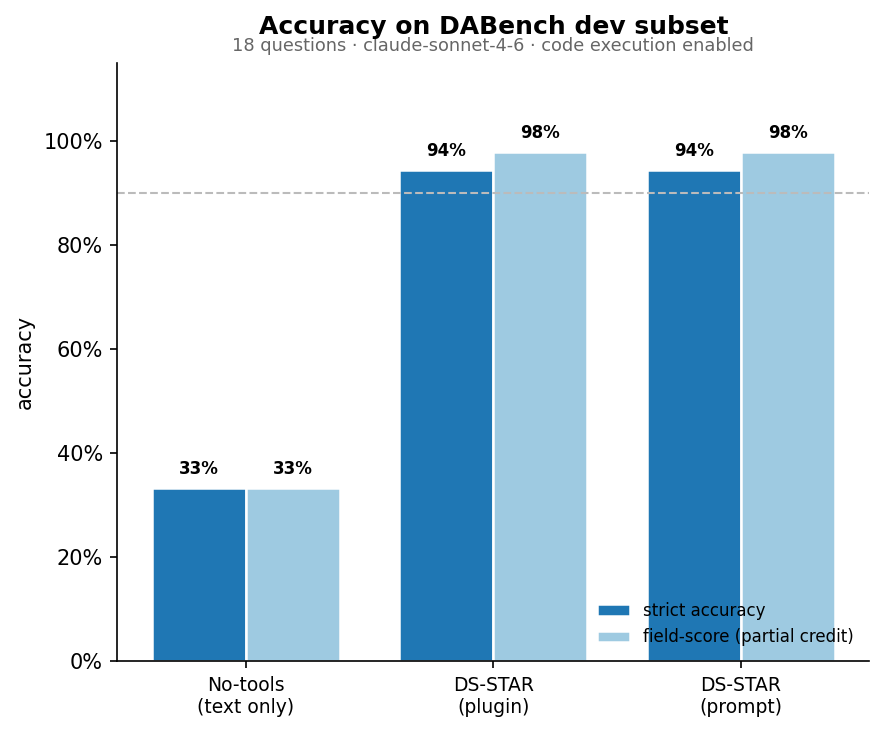
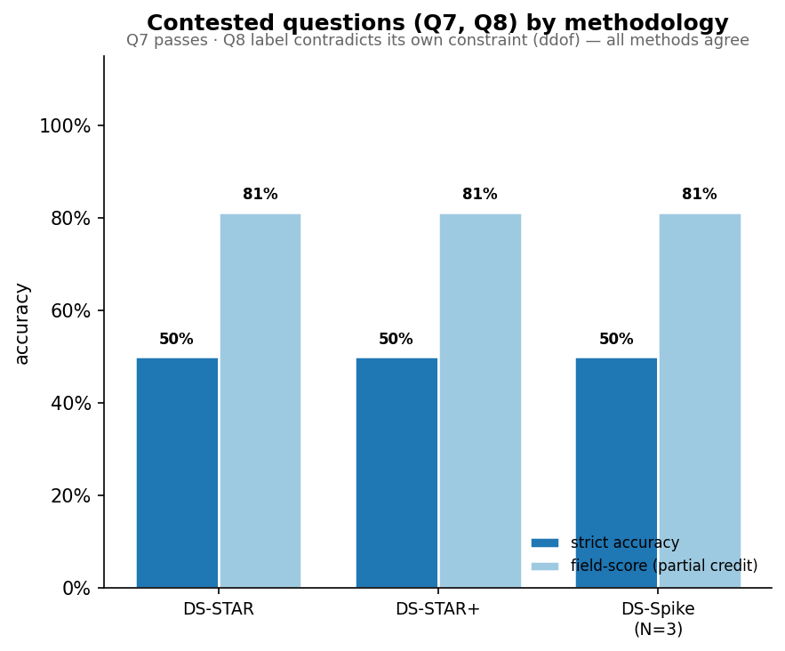
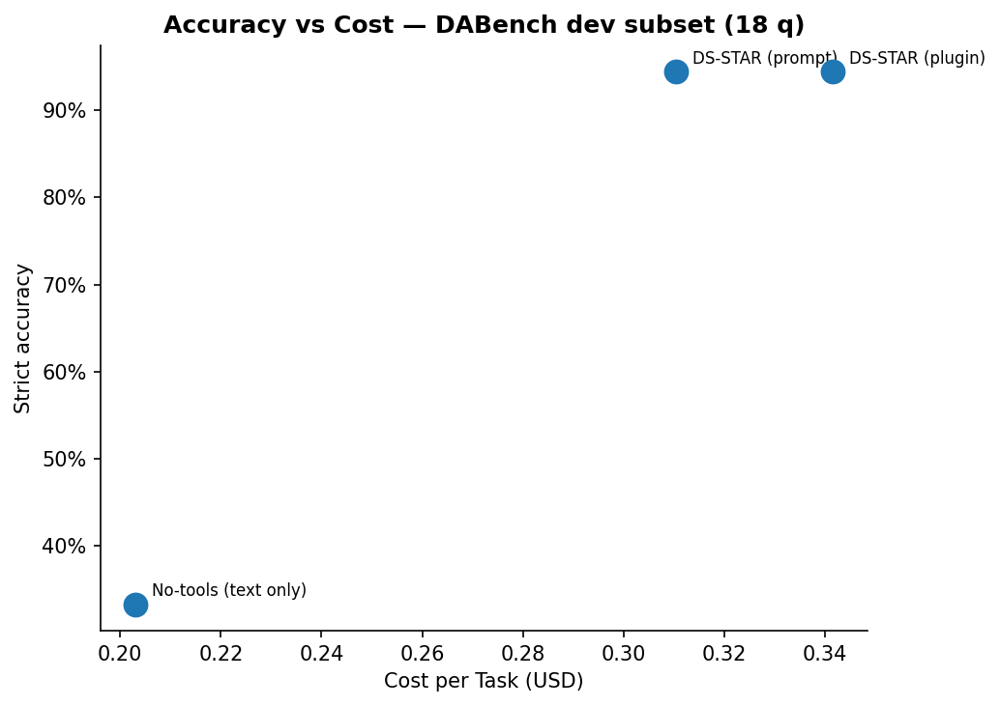
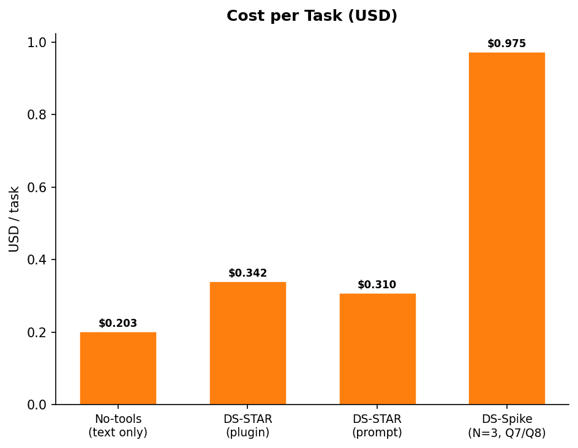

# ds-crew Benchmark Experiments

Experiments measuring what each layer of the ds-crew stack contributes, using
[InfiAgent-DAEval](https://github.com/InfiAgent/InfiAgent) (DABench dev subset,
`claude-sonnet-4-6`, plugin v1.3.1).

> **Read this first — the harness was the bottleneck, not the skills.**
> Earlier drafts of this study reported a ~73–87% ceiling and called the failures
> "skill limitations." That was wrong. Three *measurement* defects were masking the
> real result. After fixing them, ds-star scores **17/18 (94.4%)** and the single
> remaining "miss" is a benchmark-label bug, not a skill error. See
> [Scoring & harness fixes](#scoring--harness-fixes) below.

## Experiments

| # | Name | What it measures | Status |
|---|------|-----------------|--------|
| [A](A-no-tools-baseline.md) | No-tools baseline | Value of code execution itself | ✅ |
| [B](B-plugin-vs-prompt.md) | Plugin vs raw prompt | Plugin mechanism + the real loop, full 18-q set | ✅ |
| [C](C-spike-hard-questions.md) | Methods on contested Qs | Whether ensemble/verifier recover the hard cases | ✅ |

## Headline results

**Full 18-question set** (code execution enabled, fixed harness):

| variant | strict accuracy | field-score | hard | $/task | wrong |
|---|---|---|---|---|---|
| no-tools (text only) | 33% | — | 0% | $0.20 | floor — no code execution |
| **ds-star** (plugin) | **94.4%** (17/18) | 97.9% | 4/4 | $0.342 | Q8 only |
| **ds-star** (prompt) | **94.4%** (17/18) | 97.9% | 4/4 | $0.310 | Q8 only |

**Contested questions only** (Q7 + Q8), by methodology:

| method | Q7 | Q8 | $/task | observation |
|---|---|---|---|---|
| ds-star | ✓ 0.78 | ✗ 5/8 | $0.52 | population std, per the constraint |
| ds-star-plus | ✓ 0.78 | ✗ 5/8 | $0.43 | verifier produces the same answer |
| ds-spike (N=3) | ✓ 0.78 | ✗ 5/8 | $0.90 | all three personas byte-identical |

*field-score = fraction of sub-fields correct (partial credit); strict = DABench's
exact, all-or-nothing metric. The gap is the "nearly right" signal.*

## Charts

## Scoring & harness fixes

The "bad results" in earlier drafts were three harness/scoring defects, each of which
silently failed *correct* answers. All are fixed and unit-tested (`benchmarks/test_score.py`,
`test_runner.py`, `test_report.py`).

1. **Answer truncation.** The experiment drivers saved `answer[:400]`. Models write
   prose first and the `@name[value]` answer tokens *last*, so truncation chopped the
   answer off — making saved results impossible to re-score or audit. Runtime scoring
   used the full text, but the stored evidence was destroyed. **Fix:** retain full answers.
2. **Last-token-wins on echoed templates.** When a solver pastes its script
   (`print(f"@mean_fare[{mean_fare}]")`), the scorer's `dict(zip(...))` kept the *last*
   token — the literal `{mean_fare}` template — over the real `@mean_fare[34.65]`.
   This failed Q0, a question the model answered correctly. **Fix:** ignore unfilled
   `{…}` placeholder tokens (a placeholder is never a valid answer value).
3. **All-or-nothing scoring hid "nearly right."** A multi-field answer scored 0 if any
   single field diverged, so Q8 (5 of 8 fields exact) looked identical to a total miss.
   **Fix:** added a `field_score` diagnostic alongside the unchanged strict metric.

## Conclusions

### 1. Code execution is the dominant lever
No-tools text-only: 33%. A tool-using agent: 94.4%. Letting the model run code is the
single biggest factor in the stack — everything else is incremental.

### 2. The remaining "failure" (Q8) is a benchmark bug, not a skill error
Q8's constraint states verbatim: *"The population standard deviation should be calculated."*
Every method — ds-star, ds-star-plus, and all three ds-spike personas — independently
computes the population std (80.64). DABench's reference label uses the *sample* std
(80.86, pandas default), **contradicting its own constraint**. The skills follow the
instruction correctly and are marked wrong. All means and medians match exactly; only the
ddof-dependent std-devs differ. Effectively the skills answer all 18 questions correctly.

### 3. Q7 is stochastic, not broken
Q7 (LinearRegression accuracy) lands on 0.76 or 0.78 depending on a defensible
preprocessing choice — whether the 2 NaN-`Embarked` rows are dropped or kept as all-zero
dummies. The label is 0.78; the skills hit it when they keep the rows. This is normal
run-to-run variance on an under-specified question, not a capability gap.

### 4. DS-STAR methodology: structure and discipline, not raw accuracy lift
On well-defined closed-form questions, plain ds-star already hits the ceiling, so
ds-star-plus's verifier produces the same answers. The methodology's value shows on
ambiguous, multi-file, or judgment-heavy tasks that don't appear cleanly in a closed-form
benchmark — it adds verification discipline and consistent structure, not points here.

### 5. Spike (N=3) adds cost, not correctness — *on these questions*
On Q8, all three personas produced byte-identical answers at ~7× the cost of a single run.
An ensemble only helps when approaches genuinely *diverge on the answer*; here they
converge (correctly), so there is nothing to recover. Spike earns its cost on genuinely
contested questions where different strategies reach different conclusions — not on
deterministic closed-form ones.

### 6. Honest positioning
These skills handle the mechanical analysis fast and correctly (effectively 18/18 on this
subset once benchmark/harness artifacts are removed). They are a strong **kickoff and
execution tool**; the judgment that remains yours is choosing the right question, the right
data, and the right interpretation — including catching cases (like Q8) where the *spec
itself* is inconsistent.
